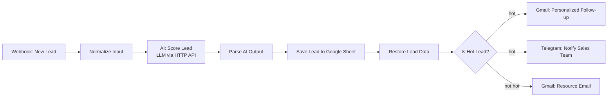

# AI Lead Qualification Agent (n8n + LLM + Google Sheets + Gmail + Telegram)

**Turn every inbound form submission into a scored lead, a CRM record, a personalized follow-up and a sales alert, automatically, in seconds.**

> Demo project. All data in this repository and in the demo video is fictional. The workflow is a working reference build that I adapt to each client's stack (HubSpot, Pipedrive, Slack, WhatsApp, etc.).

---

## The problem

Most small and mid-sized businesses lose revenue in the first hour after a lead arrives:

- Leads sit in an inbox until someone has time to read them.
- Nobody knows which lead is worth calling first.
- Follow-up emails are slow, generic, or forgotten.
- Lead data lives in five places, none of them tidy.

## What this workflow does

1. **Captures** a new lead from any web form, landing page or tool that can send a webhook.
2. **Scores** it from 0 to 100 with an LLM (budget, urgency, intent, fit) and labels it hot or not hot, with a one-line reason.
3. **Logs** the lead, score and AI summary into a Google Sheet (swappable for HubSpot, Pipedrive, Airtable or Notion).
4. **Routes** it automatically:
   - **Hot lead:** a personalized follow-up email goes out via Gmail and the sales team gets an instant Telegram alert with the lead's key details.
   - **Not hot:** the lead receives a helpful resource email, so they stay warm without taking sales time.

## Architecture



## Business value

| Before | After |
| --- | --- |
| Leads wait hours or days for a response | Every lead is scored and answered within seconds |
| Sales reads every inquiry to find the good ones | Sales is pinged only for hot leads, with a summary |
| Follow-up quality depends on who is busy | Consistent, personalized first reply every time |
| Lead data scattered across inboxes | One clean, searchable record per lead |

Typical outcomes for this kind of automation are faster first response times and less manual triage. Exact numbers depend on lead volume and your current process, so I measure them with you during the pilot instead of promising them up front.

## Tech stack

- **n8n** for workflow orchestration (self-hosted or cloud)
- **LLM API** (Groq, OpenAI or Claude compatible) for lead scoring, with JSON output
- **Google Sheets** for the lead database (replaceable by any CRM)
- **Gmail** for follow-up emails
- **Telegram Bot API** for sales alerts (replaceable by Slack, Teams or WhatsApp)

## Quick start

1. **Import the workflow.** In n8n choose *Workflows → Import from File* and select `workflow.json`.
2. **Create the Google Sheet.** Put these headers in row 1, each in its own cell:
   `Name | Email | Company | Budget | Industry | Message | Score | Label | Summary | Date`
3. **Connect credentials** in n8n (they are never stored in this repository):
   - LLM API: a *Header Auth* credential with `Authorization: Bearer <your API key>`
   - Google Sheets and Gmail: OAuth2 credentials from your Google Cloud project
   - Telegram: the token from @BotFather
4. **Fill in the placeholders:** the Google Sheet document and your Telegram chat ID.
5. **Pick your model.** Open the *AI: Score Lead* node and set `model` to one available in your LLM account.
6. **Test it** with the sample payload below, then publish the workflow.

### Sample request

```bash
curl -X POST http://localhost:5678/webhook/lead-intake \
  -H "Content-Type: application/json" \
  -d @sample-payload.json
```

See `sample-payload.json` for a ready-made hot lead. Change `budget` and `message` to something vague to see the not-hot branch.

## Customization options

- Replace Google Sheets with **HubSpot, Pipedrive, Airtable or Notion**
- Replace Telegram with **Slack, Microsoft Teams or WhatsApp**
- Tune the scoring prompt to your **ideal customer profile** and budget thresholds
- Add **enrichment** (company size, website, LinkedIn) before scoring
- Add a **human approval step** before any email is sent
- Add a **calendar booking link** to hot-lead emails
- Connect **Facebook/Instagram lead ads, Typeform, Tally or WordPress forms** as the trigger

## Security and privacy notes

- No API keys, tokens or personal data are committed to this repository.
- Use dedicated credentials with the minimum scopes required.
- Review your LLM provider's data-handling terms before sending real customer data.

## Work with me

I build and maintain practical AI automations for sales and support teams: lead qualification, RAG support chatbots, voice appointment assistants, Instagram DM booking bots and Gmail sales automation.

**Upwork profile:** coming soon — in the meantime, reach out by email below.
**Email:** dikbasyasin6@gmail.com

If you want this adapted to your CRM and your lead sources, send me a short description of your current process and I will reply with a scoped plan and fixed price.
